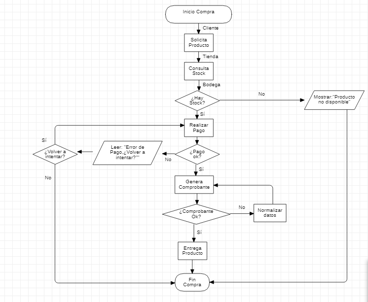

# Ejercicio de evaluación Módulo 1

En este ejercicio se evaluará la comprensión de la lógica adquirida respeto de los flujos y tomas de decisión que presenta un algoritmo. En esta oportunidad tomaremos situaciones de la vida real y serán llevados a diagramas lógicos los cuales son un punto de partida para la comprensión de la lógica inicial estructurada y para la programación de estos.

## Tabla de Contenidos
[Pregunta](#pregunta)
 - [Objetivo](#objetivo)
 - [Problemática](#problematica)
 - [Procesos](#procesos)
 - [Formato de entrega](#formato-de-entrega)
[Respuesta](#respuesta)
 - [Diagrama de Flujo](#diagrama)
 - [Representación](#representacion)

## Pregunta
## Objetivo

Leer los enunciados y representar estos de forma gráfica en diagramas de flujo simples que mostrarán la lógica de una forma inicial fácil de comprender.

## Problemática

    En el siguiente ejercicio deberá representar con sus palabras paso a paso como es y en que consiste la adquisición y compra de un producto por parte de un cliente a una tienda. 

    Puede realizar la especificación de forma simple o más compleja dependiendo de su capacidad actual de análisis del algoritmo. 

    La forma de especificación determinará la complejidad del diagrama de flujo final

    Entidades participantes: Cliente - Tienda - Bodega

### Procesos

     Solicitud de Producto de un cliente a la tienda
     Evaluación de Stock de la tienda a bodega con respuesta (si-no)
     Evaluación de Respuesta y determinar el flujo
     Compra de Producto (evaluación de pago OK)
     Generación de comprobante de compra (evaluación comprobante OK)
     Entrega de Producto

### Formato de entrega

Para entregar este trabajo solo debes subir 1 archivo comprimido en formato .ZIP

# Respuesta
### Diagrama

### Representación 
#### Solicitud de Producto de un cliente a la tienda:
      El cliente accede a la tienda y selecciona un producto, lo cual envía una petición a la tienda.
#### Evaluación de Stock de la tienda a bodega con respuesta (si-no)
      Esta solicitud llega a la Tienda, la cual realiza una consulta a la Bodega para conocer si el producto se encuentra en stock con 2 respuestas posibles: Sí - No 
#### Evaluación de Respuesta y determinar el flujo
      - Si la respuesta fue Si:
      El flujo continúa hacia El Pago
      - Si la respuesta fue No:
      Se le informa al Cliente que el Producto no está disponible y el Proceso Termina
#### Compra de Producto (evaluación de pago OK)
      Se realiza el pago, mediante un Proceso externo con 2 respuestas posibles: Sí - No
      - Si la respuesta fue Si:
      El flujo continúa hacia El Comprobante
      - Si la respuesta fue No:
      Se le informa al Cliente y se le pregunta si quiere volver a intentarlo con 2 respuestas posibles: Si - No
      - Si la respuesta fue Si:
      El flujo vuelve a Realizar Pago
      - Si la respuesta fue No:
      el Proceso Termina
#### Generación de comprobante de compra (evaluación comprobante OK)
      Una vez el Pago se ha realizado de manera correcta, se debe generar un comprobante. Se intenta generar con dos respuetas posibles: Si - No
      - Si la respuesta fue Si:
      El flujo continúa hacia la Entrega del Producto
      - Si la respuesta fue No:
      Se revisarán los datos y se intentará generar un nuevo comprobante. Este es un proceso que se desarrollará de manera asíncrona con el resto del proceso, por los que se mantendrá repitiendo hasta obtener una respuesta positiva sin interrumpir el envío del producto. Es importante checkear que el producto haya sido enviado al obtener una respuesta positiva, para asegurarse de que no se generen envíos duplicados.
#### Entrega de Producto
      Se desencadenará un proceso externo encargado de entregar este producto y el proceso termina, a menos que el registro no se haya generado aún.